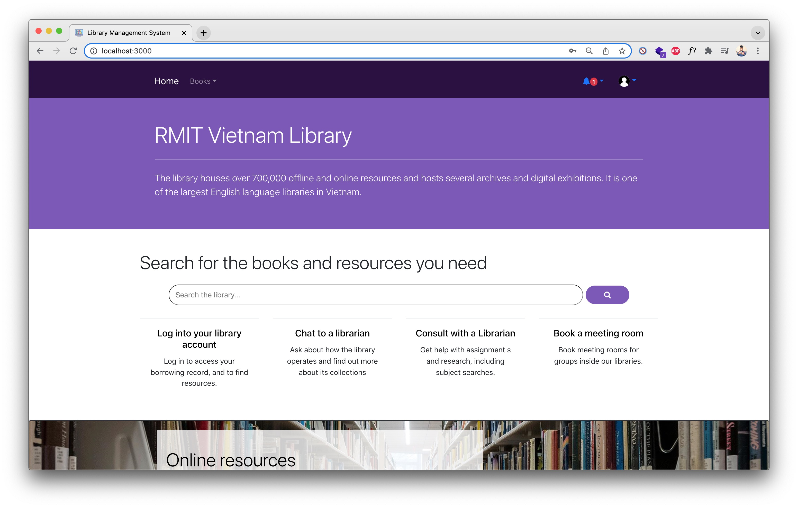

# Library Management System

# Project Introduction

RMIT's librarian system needs an update using cutting edge tech stacks. The project aims to provide a solution for the RMIT university to manage its library more efficiently. The new system will help librarian have a clear overview look of the current books in the library as well as the books being lend out. It will also allow the students to look up for their needed materials, borrow books that are available on campus.

# How to run project
1. Compose the Kafka broker container using the Dockerfile from the project folder:
`docker compose up -d`
2. Create a database named `book` in Postgres. Postgres configs: PORT=5433, username=postgres, password=(none)
3. Start the Spring Boot server from the `server` folder. The APIS are exposed from port `8081`
4. Start the frontend with `yarn start` or `npm start`. The web app should now be accessible at `http://localhost:3000`

## Testing
The folder `book-crawler-script` in `microservices` is for crawling big data for testing system load. However, as estimated, the test data would take up more than 2GB, which is not feasible to upload on Github. As a result, you might want to use the script to build up the test data on your own.

# Deployment
The front-end of the project can be viewed here:

# Functionality checklist
Architecture and Design:

	[x] Sound design of entity, crud, services, controllers

	[x] Good design of React frontends

	[x] Micro-service architecture with at least 2 micro-4.services. Separate databases for each service. Good if separate frontend/backend services (refer here: https://microservices.io/patterns/microservices.htmlLinks to an external site.)
	
	[x] Use kafka or other message queue properly

	[x] Use redis or other memory cache properly

	[x] Use docker and github for development

	[x] Deploy on cloud platforms (frontend: )

	[x] Authorization with JWT and Spring Security

Functionality

	[x] Interesting system, feasible, applicable.

	[x] Relatively complete to be rolled-out immediately or without little change

	[x] Innovative design, easy to use and friendly GUI, logical flows of operations, beautiful and polish GUI.

	[x] Consistent with the plan set at the beginning. At least 80% of features proposed in the early stage are in place.

Testing, project presentation (readme, report files)

	[] Testing: significant amount of (sample) data loaded into databases for load testing. Evidence that systems can be scaled linearly with high load i.e 1000 requests per second.

	[x] Project presentation: clearly describe the design of the system, all functionalities implemented, known bugs and issues, limitation should be stated clearly. Clearly describe the components and technologies used in the system and justification of your decision and choices.

# Project members:
- Le Tran Trong Hung
- Truong Phu Khang
- Bui Thanh Huy 
- Nguyen Trung Duc
- Nguyen Quoc Hoang